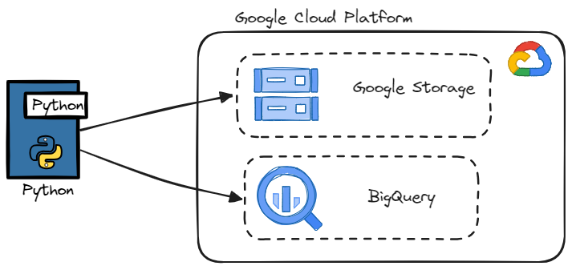
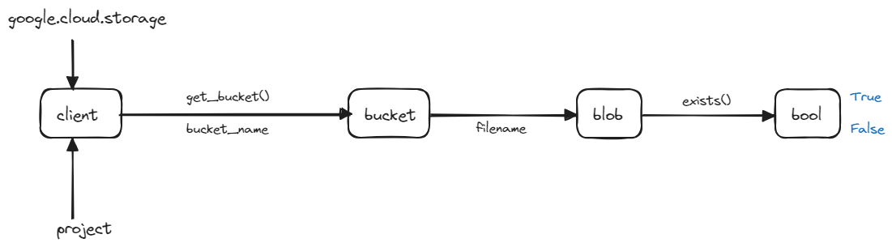
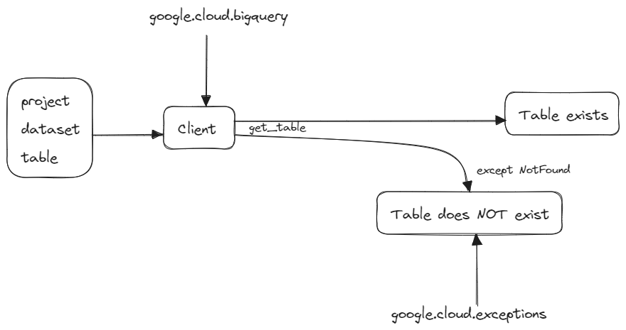
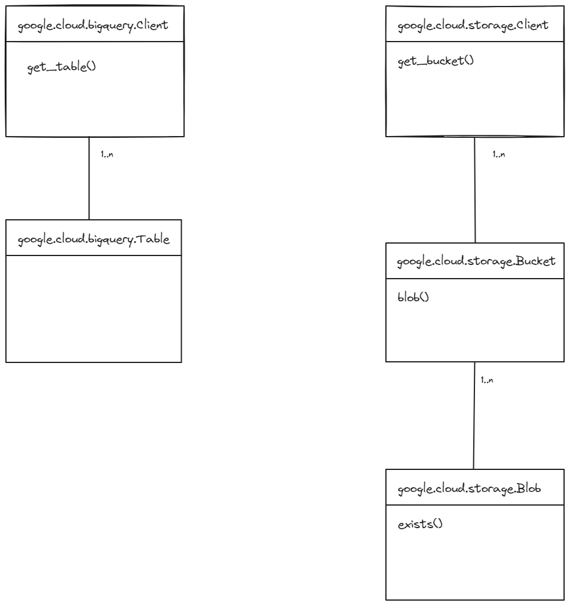

# cloud_play

## Index
- [Description](#description)
- [Architecture](#architecture)
- [Requirements](#requirements)
- [How to execute the project](#how-to-execute-the-project)
- [How to execute the Unit tests](#how-to-execute-the-unit-tests)

### Description
What is this project for?
- This
- That

### Architecture





### Requirements

### How to execute the project

To execute the code:
```bash
poetry run script

```

### How to execute the Unit tests
To execute the test:

```bash
poetry run pytest
```